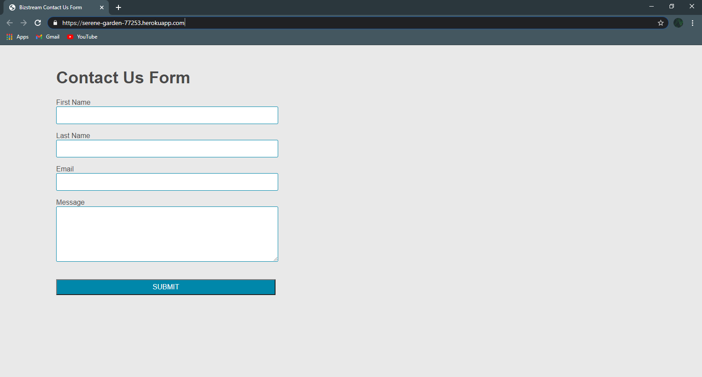

# BizStream Contact-Us-Form

## Description
Contact-Us-Form is a simple "Contact us" form that saves a copy of the responses to a .txt file in the directory of the application via Node server. Users may input their first and last name, email address as well as a message. If the user does not enter a valid email address the form will fail to submit.

## Usage
<a href="https://serene-garden-77253.herokuapp.com/">Click here to open deployed application.</a> 
<ul>
  <li>Clone repository</li>
  <li>Run "npm install" in the terminal</li>
  <li>View application at http://localhost:3001/ </li>
  <li>Submit the completed contact form </li>
  <li>Return to the code editor to view the input at "db.txt" inside the db folder.</li>
</ul>

## Questions

[Visit my repository!](https://www.github.com/alexemrob)

For any further questions email me at AlexEmRob@gmail.com
